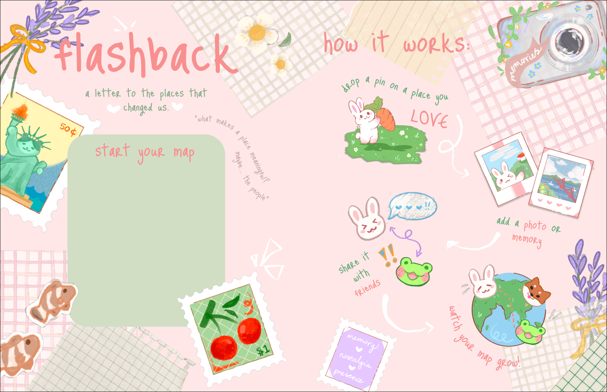

# flashback
letter to the places that changed us.

**Flashback** is a cozy, scrapbook inspired memory logging app for friends all over the world. 
It’s simple, cozy and fun ✨ – all you have to do is
👩‍💻sign up or log in
📍drop a pin on a place you love
🖼️add a photo/memory
💌share it with your besties
🌏watch your map flourish
No matter the distance between you and your squad, create fun and meaningful connections as you share memories anywhere, anytime! 

Last month, our friends group met up in San Francisco for a two week trip ✈️🌉 Exploring the park, walking on the beach, soaking in the sights and sounds of the neighborhood… There were so many beautiful moments that we wanted to cherish, ones that we wanted to remember even after we said goodbye. Hence, Flashback was born!  🎇Flashback was conceptualised based on our personal experiences – an expression of friendship between creative souls, a place to store all the wonderful memories we made 💌, in a style that’s unmistakably us.
To create an app that feels both human and true to ourselves, we hand drew all of the landing page and avatar icons, based on cozy and cute aesthetics we both love 🌷💖The interface is simple and intuitive, so that your memories take centre stage. 

love, 
afia ava + kai ling 💌

